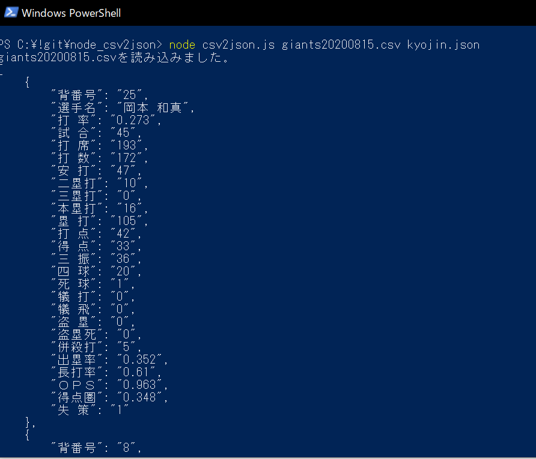

# node_csv2json
csvファイルをJSONファイルに変換します。

ファイルはコマンドライン引数で指定します。

## 注意

csvファイルの文字コードはUTF8にしてください。

shiftjisだと文字化けします。

# 【準備】モジュールのインストール

```
npm install csv
npm install commander
```

# 実行
```
node csv2json.js [読み込みファイル名.csv] [保存ファイル名.json]

//例
node csv2json.js hoge.csv aaa.json
```

```
//結果
hoge.csvを読み込みました
aaa.jsonを保存しました

```

# 使用例

ネットから適当にデータを拾ってきてcsv(UTF8)ファイルを作ります。


実行



# ToDo
- 文字コード対策
